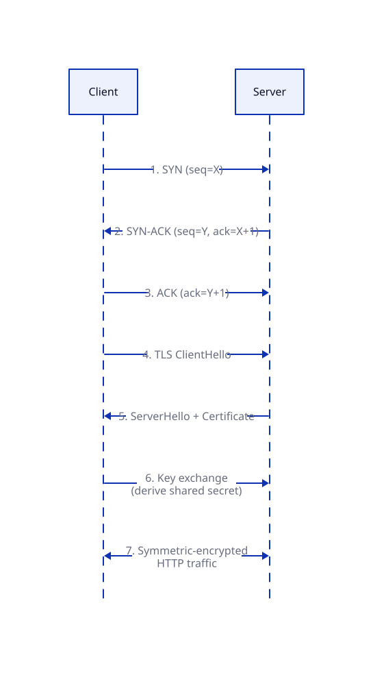

# Network Protocols (Foundation Layer)

## Problem

Every system design pattern above this layer assumes two machines can reliably find each other, exchange bytes without corruption or eavesdropping, and do it fast. That reliability isn't automatic — it's built up in layers, each solving one specific failure mode of raw packet-switched networking.

## Core idea

### TCP three-way handshake

Analogy: two people confirming a phone line works before talking — "can you hear me?" / "yes, can you hear me?" / "yes."

- **SYN** — client picks a random starting sequence number, tells server "I want to talk, starting at seq=X."
- **SYN-ACK** — server acknowledges (X+1) and sends its own starting sequence number Y.
- **ACK** — client acknowledges Y+1. Both sides now agree on starting sequence numbers for ordering/retransmission.

This is purely about **reliability** (both sides know the other is alive and agree on where byte-counting starts) — it has nothing to do with security. That's a common misconception: the handshake proves reachability, not identity or privacy.

### TLS handshake

Problem: symmetric encryption (one shared key, fast) is what you want for the actual data, but you can't safely transmit that shared key over an open channel — anyone snooping gets it too.

Solution: use slow, expensive **asymmetric crypto exactly once** to safely agree on a shared secret, then switch to fast **symmetric crypto** for the rest of the session.

1. Client hello (supported ciphers) → Server hello (chosen cipher + **certificate**).
2. Certificate is signed by a Certificate Authority the client already trusts — this is what proves "you're really talking to google.com," not just "this channel is encrypted."
3. Key exchange (e.g. Diffie-Hellman) derives a shared symmetric session key both sides compute independently without ever sending the key itself over the wire.
4. Both switch to symmetric encryption (AES etc.) for the actual data — orders of magnitude faster than asymmetric crypto per byte.

### HTTP vs HTTPS

Same protocol. HTTPS = HTTP's bytes wrapped inside a TLS-encrypted tunnel. Nothing about the HTTP verbs, headers, or semantics changes — only the transport underneath it is encrypted and authenticated.

### DNS resolution

Analogy: asking for directions by starting broad and narrowing down.

`resolver → root server → TLD server (.com) → authoritative server (example.com)`

Each step answers "who do I ask next," not "here's the IP" until the last hop. Results are cached per **TTL** (time-to-live):

- High TTL → fewer lookups, lower latency on average, but slow to pick up changes (e.g. an IP migration takes up to TTL to propagate).
- Low TTL → reacts fast to changes, but pays the lookup cost more often.

### HTTP/2 multiplexing

HTTP/1.1 needs a new TCP connection (or serial reuse) per concurrent request — each one pays a TCP + TLS handshake cost. HTTP/2 opens **one TCP connection** and interleaves multiple request/response streams over it, so you pay the handshake cost once instead of N times.

### WebSockets

Starts as a normal HTTP GET request with an `Upgrade: websocket` header. Server responds `101 Switching Protocols` and the same underlying TCP connection stops speaking HTTP and becomes a persistent, full-duplex channel — either side can push data at any time, no request/response ping-pong required. This is what enables server-push (chat, live feeds) without polling.

### L4 vs L7 load balancers

- **L4 (transport layer)**: routes purely on IP + port. Fast, doesn't decrypt anything, can't see HTTP content.
- **L7 (application layer)**: terminates TLS itself, reads the decrypted HTTP request (path, headers, cookies), and routes based on that — e.g. `/api/*` → service A, `/static/*` → service B. More CPU cost (it's doing the TLS handshake work), more routing power.

## Trade-offs

| Choice | Gain | Cost |
|---|---|---|
| High DNS TTL | Lower latency, less load on DNS infra | Slow to propagate changes |
| L7 over L4 LB | Content-aware routing | Extra CPU for TLS termination, adds a hop of latency |
| HTTP/2 multiplexing | Fewer handshakes, less latency | Head-of-line blocking still possible at TCP level |

## Where it's used

- TLS + certificates: every HTTPS site.
- L7 routing by path: the **Strangler Fig pattern** ([05](../05_Strangler_Fig_Pattern/lesson.md)) depends on exactly this to send migrated routes to new services.
- WebSockets: chat apps, live trading dashboards, multiplayer games.

## Worked example: a browser loading `https://example.com`

1. DNS resolution: resolver → root → `.com` TLD → `example.com` authoritative server → IP address (cached per TTL).
2. TCP three-way handshake to that IP on port 443.
3. TLS handshake over that TCP connection: certificate exchange, key exchange, switch to symmetric encryption.
4. HTTP/2 request multiplexed over the now-secure connection; an L7 load balancer at `example.com`'s edge terminates TLS and routes the request by path to the right backend service.

## Diagram

