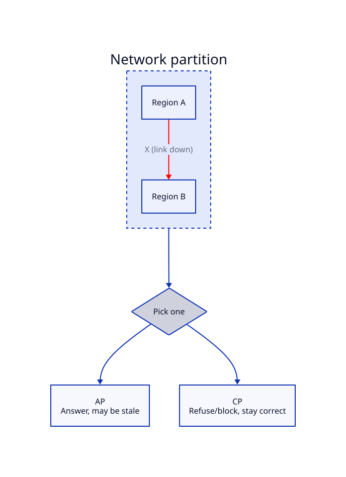

# CAP Theorem

## Problem

Once you replicate data across multiple machines for availability or scale, a network partition between them is not a rare edge case — it's a certainty eventually (a cable gets cut, a data center loses connectivity, a node hangs). The system has to decide what happens when replicas can't talk to each other but a client is still asking for data right now.

## Core idea

Analogy: two branches of a bank that can't currently call each other, and a customer walks into one asking for their balance. The branch has two choices: refuse to answer until it can confirm with the other branch (correct but unavailable), or answer with what it last knew (available but possibly stale/wrong).

During a partition, a system must pick:

- **Consistency (C)** — every read returns the most recent write, or an error. The system may refuse to answer rather than risk returning stale data.
- **Availability (A)** — every request gets a response, but it might not reflect the latest write.

You cannot have both **during a partition** — that's the theorem. (Outside of a partition, when all nodes can talk, you can have both — CAP is specifically about partition behavior, not a permanent trade-off.)

Note: "Partition tolerance" isn't really a choice — in any real distributed system, partitions *will* happen, so P is a given, not a dial you turn. The actual live choice is CP vs AP.

## Trade-offs

| Choice | Behavior during partition | Good fit |
|---|---|---|
| **CP** | Refuses/blocks rather than serve stale data | Banking, inventory counts, anything where a wrong answer is worse than no answer |
| **AP** | Always answers, may be stale | Social feeds, view/like counters, shopping cart availability — staleness is cheap |

This is a **per-domain** choice, not a system-wide one — a single application can be CP for its payment path and AP for its activity feed.

## Where it's used

- Banking/payment ledgers lean CP — better to reject a transaction than double-spend or show a wrong balance.
- Social media feeds, DNS, and most caching layers lean AP — a slightly stale feed or view count is harmless, but downtime isn't.

## Worked example

A social media "likes" counter is replicated across 3 regions. Region A and Region B lose connectivity to each other (partition) but both are still reachable by users.

- **If CP**: both regions stop accepting new likes until connectivity is restored, to avoid diverging counts. Users see errors.
- **If AP**: both regions keep accepting likes locally. When the partition heals, the counts are reconciled (e.g. summed, or last-write-wins). Users never see an error, but the count might briefly be inconsistent between regions.

Real systems (Instagram-style like counters) choose AP here — a transiently wrong like count is invisible to the user experience, but an error message isn't.

## Diagram

