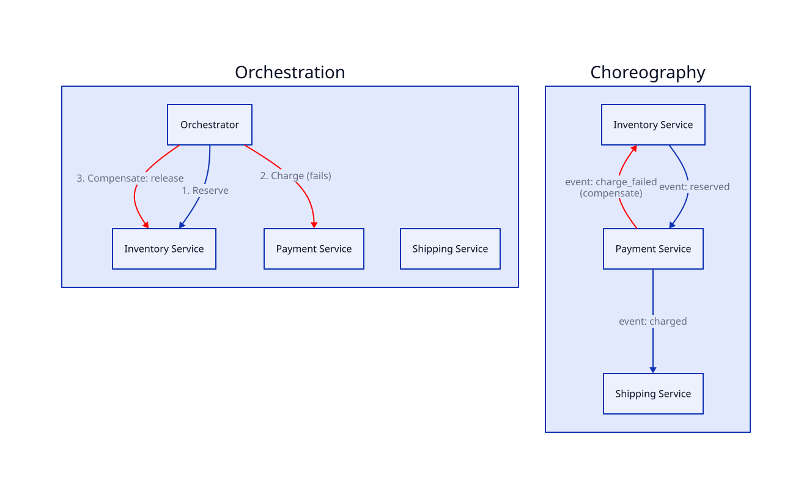

# Microservices & Saga Pattern

## Problem

A monolith deploys and scales as one unit — a change to the checkout module means redeploying (and rescaling) the entire application, including unrelated modules like user profiles. As teams and features grow, that coupling becomes the bottleneck.

## Core idea

**Microservices** split a monolith into independently deployable services, each owning its own database. That independence is the whole point — but it has a direct cost: a single business operation that used to be one ACID transaction across tables now spans multiple services with separate databases, and there's no free distributed transaction to fall back on.

Analogy: booking a trip that involves a flight, a hotel, and a rental car, each booked through a different, independent company. There's no single "transaction" spanning all three — if the rental car booking fails after the flight and hotel succeeded, you can't just roll back all three atomically. You have to explicitly cancel the flight and hotel.

That's the **Saga pattern**: replace one distributed ACID transaction with a sequence of local transactions, each with a **compensating action** defined up front to undo it if a later step in the sequence fails.

Two ways to coordinate the sequence:

- **Choreography** — each service publishes an event when it finishes its step; other services listen and react. No central coordinator. Decentralized and loosely coupled, but the overall flow is implicit — hard to trace "what happens when an order is placed" without reading every service's event handlers.
- **Orchestration** — a central orchestrator service explicitly calls each step in order and decides what to do on failure (including triggering compensations). The flow is explicit and easy to debug in one place, but every service is now coupled to the orchestrator's contract.

## Trade-offs

| | Gain | Cost |
|---|---|---|
| Microservices over monolith | Independent deploy/scale per service | No cross-service ACID transactions |
| Saga over 2PC (two-phase commit) | Doesn't block/lock resources across services while waiting | Only eventually consistent; compensations must be designed for every step |
| Choreography | Decentralized, no single point of failure | Hard to trace/debug the overall flow |
| Orchestration | Explicit, centralized, easy to debug | Coordinator is a coupling point and potential bottleneck |

## Where it's used

E-commerce order placement: reserve inventory → charge payment → schedule shipping. If payment fails after inventory was reserved, a compensating action releases the reserved inventory.

## Worked example (orchestration)

1. Orchestrator calls **Inventory service**: reserve 1 unit. Success.
2. Orchestrator calls **Payment service**: charge $50. **Fails** (card declined).
3. Orchestrator triggers the compensating action for step 1: **Inventory service** releases the reservation.
4. Order marked failed. No partial state left behind — the system ends up consistent, just via explicit undo rather than an atomic rollback.

## Diagram

