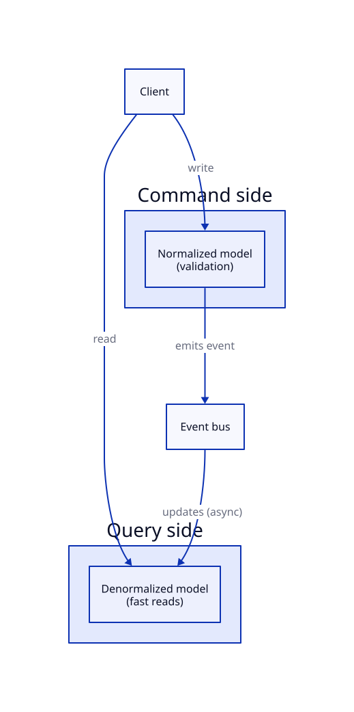

# CQRS (Command Query Responsibility Segregation)

## Problem

A single data model has to serve two very different jobs: writes need strict validation and normalization to stay correct, while reads need to be fast and shaped exactly like the UI wants them — often joining data that's normalized across many tables. Optimizing one model for both tends to make it mediocre at each.

## Core idea

Analogy: a restaurant kitchen (writes — precise, validated, one order at a time, correctness matters) versus the menu board (reads — pre-formatted for fast scanning, doesn't need to be re-derived from raw ingredients every time someone looks at it).

CQRS splits the data model in two:

- **Command side** — handles writes. Normalized schema, enforces validation and business rules. Optimized for correctness, not speed.
- **Query side** — handles reads. Denormalized schema (or even a different database entirely, e.g. Elasticsearch for search), shaped for fast retrieval exactly as the UI needs it.

The two sides are kept in sync via **events**: every write on the command side emits an event, and a subscriber updates the query side's denormalized copy. This means the query side is **eventually consistent** — there's a small window where a write has happened but the read model hasn't caught up yet.

That eventual consistency is the trade being made deliberately: it's acceptable specifically because the *cost* of a stale read is low in the domains CQRS is used for (unlike CAP's CP choice for banking, where staleness is unacceptable).

## Trade-offs

| | Gain | Cost |
|---|---|---|
| Separate read/write models | Each optimized for its actual access pattern | More moving parts — two schemas, a sync mechanism |
| Eventual consistency via events | Query side can scale/denormalize freely | Reads can briefly lag writes |

## Where it's used

Product catalogs with heavy browse/search traffic but controlled, validated inventory writes — writes go through a normalized command model, while search/browse hits a denormalized, search-optimized read model kept in sync via events.

## Worked example

1. A seller updates a product's price (write) → **Command side**: validated, written to the normalized products table.
2. That write emits a `PriceUpdated` event.
3. A subscriber updates the **Query side**'s denormalized search index (e.g. Elasticsearch document for that product) with the new price.
4. Until step 3 completes, a shopper searching the catalog might briefly see the old price — acceptable, since the checkout flow re-validates the actual price against the command side before charging.

## Diagram

