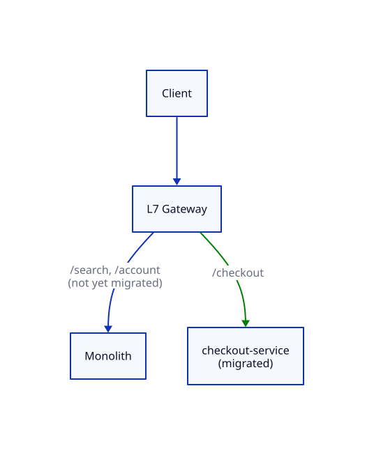

# Strangler Fig Pattern

## Problem

Rewriting a monolith into microservices in one shot means months of parallel development followed by a single high-stakes cutover — if anything's wrong, you find out in production, all at once, with no gradual rollback path.

## Core idea

Named after the strangler fig vine, which grows around a host tree and gradually replaces it without ever needing to fell the tree at once.

Put an **L7 gateway** in front of the monolith. Initially, every route points to the monolith. To migrate one piece of functionality:

1. Build the new microservice implementing that one piece.
2. Update the gateway's routing rule so requests to that specific path go to the new service instead of the monolith.
3. The monolith keeps serving everything not yet migrated.
4. Repeat, path by path, until the monolith has nothing left routed to it — at which point it can be decommissioned.

This depends directly on [L7 load balancers](../01_Network_Protocols/README.md) being able to route on HTTP path/content, not just IP/port — an L4 balancer can't make this per-route decision.

## Trade-offs

| | Gain | Cost |
|---|---|---|
| Incremental migration | Each piece validated in production independently; rollback is just a routing change | Slower overall timeline than a big-bang rewrite |
| Gateway-based routing | No client-visible change — same URL structure throughout | Gateway becomes a critical dependency; adds a routing hop |

## Where it's used

Any large legacy-to-microservices migration where downtime or a risky cutover isn't acceptable — e.g. migrating an e-commerce monolith's checkout flow to its own service while search, catalog, and account pages still run on the old monolith.

## Worked example

1. Monolith serves `/checkout`, `/search`, `/account` — all routes point to the monolith at the gateway.
2. Build a new `checkout-service`. Update the gateway: `/checkout` now routes to `checkout-service`; `/search` and `/account` still route to the monolith.
3. If `checkout-service` has a critical bug, revert the routing rule — traffic goes back to the monolith's checkout code instantly, no redeploy of the service needed.
4. Once confident, repeat for `/search`, then `/account`. When no route points to the monolith anymore, it's decommissioned.

## Diagram

