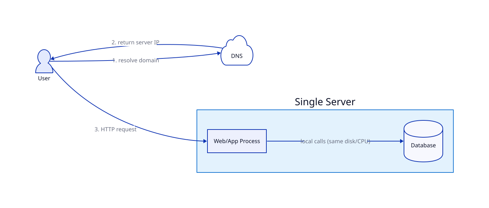

# Single Server

## Problem

Need a running system fast (MVP, hackathon, early product) without building infrastructure you don't need yet.

## Core idea

Web/app process and database run as separate processes on one machine. App↔DB calls go over a local socket/localhost — no network hop, the fastest data access you'll get.

## Trade-offs

| | Gain | Cost |
|---|---|---|
| One box | Trivial setup/deploy, no network latency to DB | One crash takes down app + DB together |
| Shared resources | Nothing to orchestrate | Can't scale app/DB independently; both fight for the same CPU/RAM during spikes |

## Where it's used

MVPs, hackathon projects, early-stage products with a handful of users.

## Diagram

