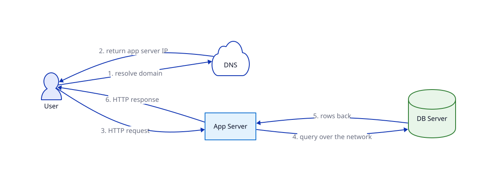

# Application & DB Server Separation

## Problem

On a single server, app and database fight over the same CPU/RAM, and you can't scale one without paying for the other.

## Core idea

Move the database onto its own machine. The app server talks to it over the network (e.g. `postgres://db-host:5432`) instead of a local socket. DNS resolves the domain to the app server's IP only — the DB server has no public IP.

## Trade-offs

| | Gain | Cost |
|---|---|---|
| Two machines | App and DB no longer fight over the same CPU/RAM; independent scaling | Every query now crosses the network instead of a local socket — added latency |
| DB has no public IP | Smaller attack surface | App server becomes the only path to the DB — if it's down, nothing can reach the DB either |

Still unresolved: there's exactly one app server and one DB server. Either crashing still takes down the whole system — this step fixes resource contention, not single point of failure.

## Where it's used

The default two-tier shape almost every web app grows into right after the single-server stage.

## Diagram

