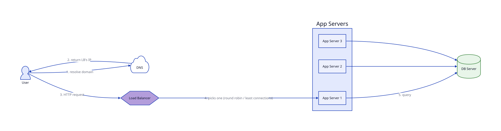
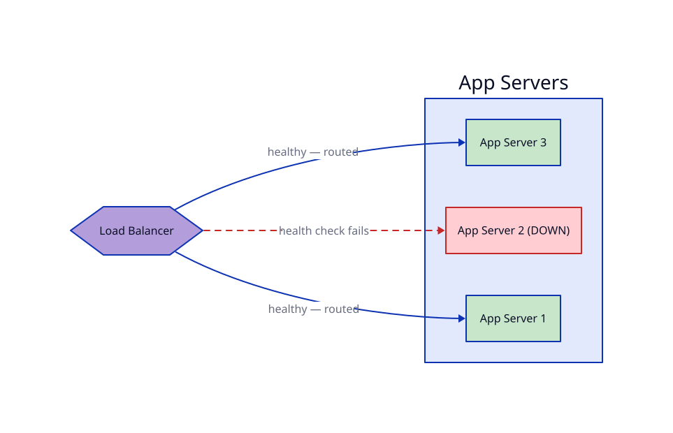

# Load Balancer & Multiple App Servers

## Problem

After [separating app and DB servers](../02_Application_DB_Server_Separation/lesson.md), one problem was left explicitly open: there's still exactly **one** app server. If it crashes, the whole system is down. If traffic exceeds what it can handle, there's no second machine to absorb the overflow.

## Core idea

Put a **load balancer (LB)** in front of *multiple* app servers, all identical, all able to handle any request.

1. DNS now resolves the domain to the **load balancer's** IP — not any individual app server's. The app servers have no public IP of their own, same reasoning as the DB server in lesson 2.
2. The LB receives every request and picks one app server to send it to — commonly *round robin* (cycle through servers in order) or *least connections* (send to whichever server currently has the fewest active requests).
3. That app server handles the request, queries the (still single, for now) DB server, and returns a response through the LB back to the user.
4. The LB continuously **health-checks** every app server (e.g. pinging a `/health` endpoint every few seconds). If one stops responding, the LB stops routing to it — traffic quietly shifts to the healthy ones.

This is what actually kills the single-point-of-failure problem: no *one* app server crashing takes the system down anymore, and you can add more app servers under load instead of being capped by one machine's capacity.

## Trade-offs

| | Gain | Cost |
|---|---|---|
| Multiple app servers | No single app server is a SPOF; horizontal scaling — add servers as traffic grows | App servers must be interchangeable — no server-specific state |
| Health checks | LB automatically routes around a crashed/unhealthy server | Adds a monitoring loop that must itself be tuned (too aggressive = false positives, too slow = requests still hit a dying server) |
| One more hop (through the LB) | — | Slight added latency vs. hitting an app server directly |

**The trap this introduces:** if your app used to store session data (e.g. "user is logged in") in that one server's memory, it breaks now — the next request might land on a *different* server that's never heard of that session. Fix: keep app servers **stateless** (session data goes in a shared store — a database or cache — not server memory), so any server can handle any request.

**The trap this doesn't fully close:** the load balancer is now the new single point of failure — if *it* goes down, no app server is reachable either. Production setups run LBs in redundant pairs or use a managed LB service (e.g. a cloud provider's load balancer) that's redundant by default. This lesson focuses on what the LB does; the LB's own redundancy is a deeper topic on its own.

## Where it's used

Essentially every production web system beyond hobby scale — behind names like an AWS Application Load Balancer, Nginx, HAProxy, or a cloud provider's managed load balancer.

## Diagrams

