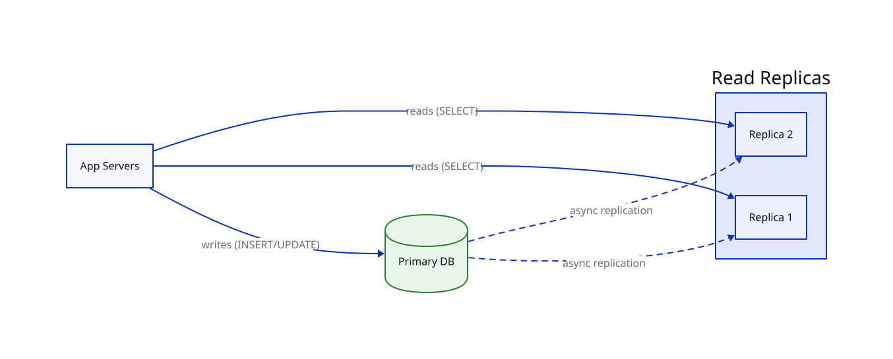

# DB Replication

## Problem

After [adding a load balancer](../03_Load_Balancer_Multiple_App_Servers/lesson.md), the app tier can scale to N servers and survive any one of them dying. The database can't — it's still exactly one machine. Every read and every write goes through it, it caps how much traffic the whole system can handle, and if it dies, everything dies with it.

## Core idea

Add one or more **replica** databases that hold a copy of the primary's data.

- The **primary** (or "leader") is the only one that accepts **writes** (INSERT/UPDATE/DELETE).
- The primary continuously ships its changes to each **replica**, which stays synced up and serves **reads** (SELECT).
- App servers are updated to send writes to the primary and reads to a replica — this is a real code change (a "read/write split"), not something that happens automatically.

This directly fixes two things at once: reads can now be spread across as many replicas as you add (read scaling), and if a replica dies, the others keep serving reads while you provision a new one.

**Replication has a timing choice that matters:**

- **Asynchronous** (the common default) — the primary confirms the write immediately and ships the change to replicas in the background. Fast writes, but a replica can be a few milliseconds (sometimes more, under load) *behind* the primary.
- **Synchronous** — the primary waits for at least one replica to confirm it received the write before telling the app the write succeeded. No lag, but every write is now only as fast as the slowest replica's acknowledgment.

## Trade-offs

| | Gain | Cost |
|---|---|---|
| Read replicas | Read traffic scales horizontally — add replicas as read load grows | Writes are still bottlenecked to one primary — this doesn't fix write scalability at all |
| Async replication | Writes stay fast | Replica lag — a replica can serve **stale** data for a brief window after a write |
| Sync replication | No lag, replicas are always current | Every write is slower, bounded by the slowest replica |

**The trap this doesn't fully close:** replacing a dead primary isn't automatic by default — something (a human, or failover tooling) has to detect the primary is gone and promote a replica to take its place. Until that happens, writes are unavailable even though reads keep working fine off the surviving replicas.

## Worked example

A classic bug this setup introduces — **read-after-write on the wrong replica**:

1. A user updates their profile picture. The app server writes it to the **primary**.
2. The primary immediately confirms success (async replication) — the app tells the user "saved!"
3. The user's *next* page load triggers a read, which the load balancer/read-routing sends to a **replica**.
4. If that replica hasn't received the replicated change yet, the user sees their *old* profile picture — even though the save definitely succeeded.

This isn't a bug in the database — it's the direct, expected cost of async replication. Systems that need read-after-write consistency for specific actions (like "show my own update instantly") route that specific read back to the primary, or to a replica confirmed to be caught up, instead of any replica.

## Where it's used

Any production database beyond small scale — MySQL/Postgres primary-replica setups, or a managed offering like an AWS RDS read replica.

## Diagram

