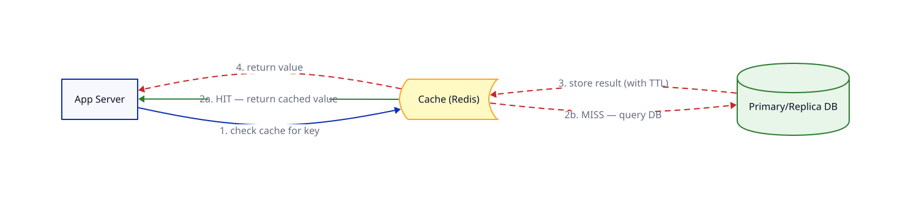

# Cache

## Problem

[Read replicas](../04_DB_Replication/lesson.md) spread reads across multiple machines, but every single read is still a real database query. For data that's requested constantly and barely changes — a popular product page, a user's profile, a trending post — that means thousands of identical queries answering the exact same question over and over, burning DB capacity that could go toward the reads that are actually new.

## Core idea

Put a **cache** — an in-memory key-value store (Redis, Memcached) — between the app servers and the database. The most common pattern is **cache-aside** (a.k.a. lazy loading):

1. On a read, the app checks the cache first for that key.
2. **Cache hit** — the value is there, return it immediately. No database involved at all.
3. **Cache miss** — the value isn't cached (or expired). Query the database, then **store the result in the cache** (usually with a TTL — time-to-live) before returning it.
4. The next request for that same key hits the cache instead of the database — until the TTL expires or the entry is invalidated.

The reason this works so well: memory access is roughly an order of magnitude faster than a disk-backed database query, and for "hot" keys, one cache-miss query ends up serving hundreds or thousands of subsequent reads for free.

## Trade-offs

| | Gain | Cost |
|---|---|---|
| Cache hits | Much faster reads, and the DB never sees that query | Needs a new piece of infrastructure to run and monitor |
| Fewer DB reads | Frees DB capacity for writes and for reads that aren't cached | Introduces **cache invalidation** — the cache can serve stale data after the underlying row changes |
| TTL-based expiry | Simple — no code needed to invalidate anything | The cache can serve outdated data for up to the full TTL window |
| Explicit invalidation on write | Cache is correct immediately after a write | Every write path must remember to invalidate the right key(s) — easy to miss on complex data |

**The trap this introduces:** if the cache goes down (or is cold after a restart), every request that would've hit it now floods straight through to the database — a "cache stampede" or "thundering herd." A database sized for cache-reduced load can buckle under that sudden full load.

This is the same underlying trade-off as [replication lag](../04_DB_Replication/lesson.md) from the last lesson, just at a different layer: something can hand back an answer that's technically correct-as-of-a-moment-ago instead of correct-right-now, in exchange for speed.

## Worked example

A product page for a popular item gets 10,000 views/minute.

1. **Without a cache:** all 10,000 views run the same "fetch this product" query against the database — 10,000 near-identical queries for data that hasn't changed.
2. **With cache-aside, TTL = 60s:** the first request misses, queries the DB, and stores the result in the cache. The other 9,999 requests that minute hit the cache — the database sees **one** query instead of ten thousand.
3. Someone updates the product's price. With TTL-only expiry, users can see the **old** price for up to 60 seconds until it naturally expires. With explicit invalidation, the write path deletes that cache key the moment the price changes — the very next read is a cache miss that fetches the fresh price immediately.

Neither approach is "wrong" — it depends on how stale is acceptable for that specific piece of data. A price might need explicit invalidation; a "like count" might be fine with a 60-second TTL.

## Where it's used

Nearly everywhere with real read traffic: caching hot database rows (products, profiles, posts), API response caching, computed/aggregated values (leaderboards, view counts) — and, notably, the **external session store** that [statelessness](../03_Load_Balancer_Multiple_App_Servers/lesson.md) required back in lesson 3 is usually exactly this kind of cache.

## Diagram

