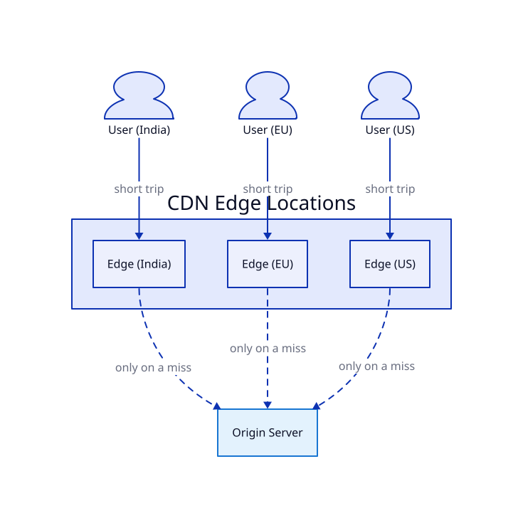
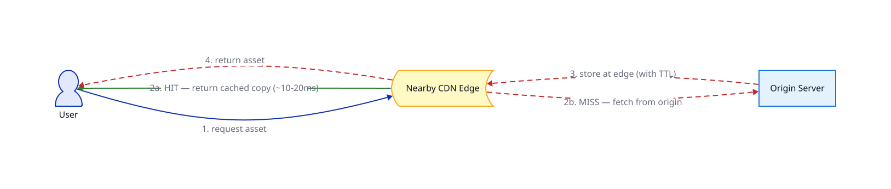

# CDN

## Problem

A [cache](../05_Cache/lesson.md) cuts out repeat database queries, but it doesn't touch a different cost: physical distance. If your servers live in one data center and a user is on the other side of the planet, every request pays real network latency just for the round trip — 100+ milliseconds, independent of how fast your app, cache, or DB are. And a static file (a hero image, a JS bundle) that never changes still gets re-fetched from your origin server by every single user, worldwide, over and over.

## Core idea

A **CDN (Content Delivery Network)** is a globally distributed set of **edge servers** ("points of presence") that cache copies of your content physically close to users. Routing (via DNS/anycast) sends each user to their *nearest* edge, not to your origin.

This is the **exact same cache-aside mechanic as lesson 5** — just distributed across many locations instead of one cache cluster, and sitting in front of your whole origin server instead of just the database:

1. A user requests a static asset. The request goes to the nearest edge location, not to the origin server.
2. **Edge hit** — the edge already has this asset cached. Return it immediately — a short trip, ~10-20ms instead of a trip across the globe.
3. **Edge miss** — the edge fetches the asset from the origin server once, caches it (with a TTL), then returns it. Every subsequent nearby user hits the cached copy.

## Trade-offs

| | Gain | Cost |
|---|---|---|
| Edge locations near users | Latency drops dramatically for geographically distant users | Another piece of infrastructure (a CDN provider) to configure and pay for, usually per-bandwidth |
| Origin absorbs far fewer requests | Static-asset traffic barely touches your origin server at all | Only helps content that's the same for everyone — dynamic, personalized, or write-heavy requests (login, checkout, a personalized feed) still go straight to origin |
| TTL-based edge caching | Same simple invalidation model as lesson 5 | Same staleness cost, multiplied across every edge location — an update can take a while to reach all of them unless you explicitly purge |

**The same trap as lesson 5, one layer further out:** updating a cached asset doesn't instantly update every edge location. You either wait out the TTL everywhere, or explicitly purge/invalidate the CDN's cache for that URL.

## Worked example

An origin server in the US serves a homepage hero image.

1. **Without a CDN:** a user in India requests the image; the request crosses roughly half the globe to the US origin and back — 200ms+, every time, for an image that never changes.
2. **With a CDN:** DNS/anycast routes that request to a nearby edge location in India instead. First request there is a miss — it fetches from the US origin once, caches the image at that edge. Every later request from users near that edge location is a hit, at ~10-20ms.
3. The company updates the hero image. Old copies persist at every edge until their TTL expires, unless the company explicitly purges the CDN's cache for that image URL — the identical TTL-vs-explicit-invalidation choice from lesson 5, just now facing dozens of edge locations instead of one cache cluster.

## Where it's used

Nearly every production website/app, for static assets specifically — images, videos, JS/CSS bundles, downloadable files. Common providers: Cloudflare, Akamai, AWS CloudFront, Fastly.

## Diagrams

