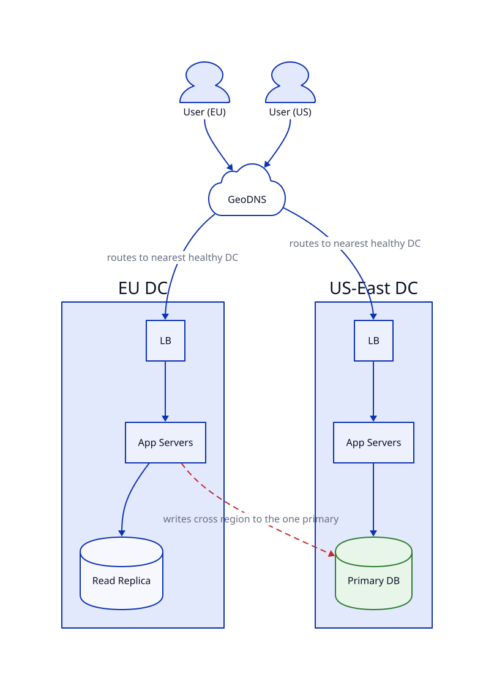

# Data Centre

## Problem

Everything so far still lives in one data center. A CDN handles static assets at the edge, but the actual application (dynamic requests, writes) all runs in one facility — if it loses power or the region has an outage, the whole system goes down regardless of redundancy inside it.

## Core idea

Run the full stack in multiple data centers across regions, each with its own LB, app servers, cache, and DB (a replica of the lesson-4 primary, now geographically distributed). GeoDNS routes each user to their nearest healthy region — same idea as CDN edge routing, but for the whole app, not just static files.

Reads can be served entirely locally from a region's own replica. Writes still have to reach the one primary DB, wherever it lives — even a user right next to another region's data center has their write cross to the primary region.

## Trade-offs

| | Gain | Cost |
|---|---|---|
| Multiple data centers | Survives an entire facility/region going down, not just one machine | Running N full copies of infrastructure — multiplied cost and complexity |
| Local reads per region | Lower latency for dynamic, non-cacheable requests too | Writes from a non-primary region still cross the globe to the one primary |
| GeoDNS routing | Auto-routes users to their nearest healthy region | Cross-region replication lag is worse than same-datacenter replication |

Honest limit: without a much more advanced multi-primary/active-active DB design, there's still exactly one place writes can land. Multi-region buys read locality and disaster tolerance, not equally-fast writes everywhere.

## Where it's used

Large-scale global systems with real availability/latency needs — major social platforms, global e-commerce, or businesses with disaster-recovery regulatory requirements.

## Diagram

