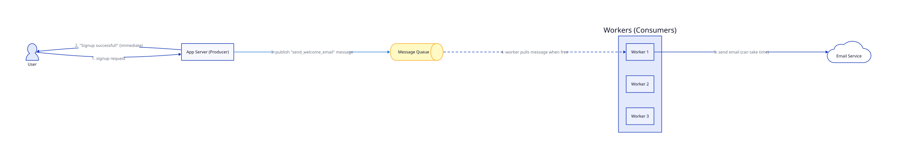

# Messaging Queue

## Problem

Every request handled so far is **synchronous**: the app server does all the work — query the DB, maybe hit the cache — and only then responds. But some work is slow or unpredictable and isn't actually needed before the user gets a response: sending a confirmation email, transcoding an uploaded video, generating a PDF invoice. If the app server does that work inline, the user waits for the slowest step, and a spike in that work ties up app servers that should be free to handle other users' requests.

## Core idea

A **message queue** lets one part of the system (a **producer**) drop a message describing work to be done, and move on immediately — without waiting for that work to finish. A separate **consumer** (a worker process, often several running in parallel) pulls messages off the queue and does the actual work, at its own pace.

1. A user signs up. The app server (producer) saves the user, then publishes a message like `{type: "send_welcome_email", user_id: 123}` to the queue.
2. The app server responds "Signup successful!" immediately — the user was never waiting on the email at all.
3. A worker (consumer) picks up that message whenever it's free, sends the actual email, independently of the request that created it.
4. If the email service is slow or briefly down, only the worker notices — the app server and the user's signup experience are completely unaffected.

## Trade-offs

| | Gain | Cost |
|---|---|---|
| Producer/consumer split | Fast, consistent response times for the user, regardless of how slow the background work is | The work is no longer immediate — it's eventually-consistent; a user could refresh before it's actually done |
| Independent scaling | Add more worker instances to drain the queue faster, without touching app servers at all | A new piece of infrastructure (RabbitMQ, Kafka, SQS) to run and monitor |
| The queue as a buffer | Absorbs traffic spikes — 10,000 jobs just sit queued, workers drain them at a sustainable rate instead of everything hitting at once | Failed jobs need their own explicit handling — retries, dead-letter queues for messages that keep failing — a synchronous call just returns an error the user can retry; a failed async job needs its own recovery logic |

This is the same "buffer against spikes" idea as a [cache](../05_Cache/lesson.md) — just absorbing spikes in **background work** instead of spikes in **reads**.

**One trap worth knowing exists, without going deep on it here:** most queues guarantee "at-least-once" delivery, not "exactly-once" — a worker might occasionally process the same message twice (e.g., if it crashes right after finishing but before confirming). Work handled by consumers usually needs to tolerate being done more than once (idempotency) rather than assuming it happens exactly once.

## Worked example

A user uploads a video to a video-sharing site.

1. The app server saves the raw file, publishes `{type: "transcode_video", video_id: 456}` to the queue, and immediately responds "Upload received! Processing..."
2. A pool of transcoding workers — possibly on entirely separate, more powerful machines than the app servers — pick up jobs and transcode the video into multiple resolutions. This can take minutes, but the HTTP request that started it ended in milliseconds; nothing is blocked waiting on it.
3. Once a worker finishes, it updates the video's status to "ready" in the DB, and the frontend polls or gets notified to show the finished video.
4. If 100 videos get uploaded in the same minute, the queue just holds 100 jobs. Workers process them at whatever sustainable rate they can handle — instead of 100 simultaneous transcode jobs trying to run on the app servers at once and grinding everything to a halt.

## Where it's used

Sending emails/notifications, processing uploaded media, generating reports, order-processing pipelines — any "the user doesn't need to wait for this" background work. Real systems: RabbitMQ, Apache Kafka, AWS SQS.

## Diagram

