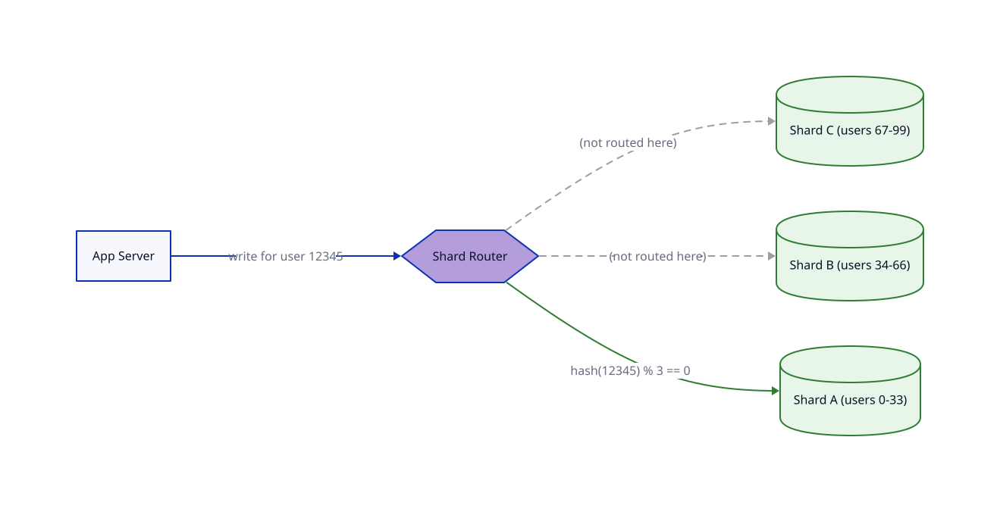

# DB Scaling

## Problem

Replication and multi-region both scaled reads. Writes have stayed on a single primary the whole time — eventually one machine's capacity (vertical scaling) hits a ceiling.

## Core idea

Split the data itself across multiple database machines — sharding (horizontal partitioning):

1. Pick a shard key (e.g. `user_id`).
2. A function of that key (e.g. `hash(user_id) % number_of_shards`, or a range split) decides which shard owns a given row.
3. Each shard is a separate DB machine, and can have its own primary + replicas — sharding and replication combine, they're not alternatives.
4. A routing layer computes the shard key per query and sends it to the right shard.

Writes for different users land on different machines — write capacity scales with shard count, not one machine's ceiling.

## Trade-offs

| | Gain | Cost |
|---|---|---|
| Sharding | Write throughput scales horizontally | Cross-shard queries (not using the shard key) must hit every shard and merge results |
| Smaller data per shard | Smaller indexes, less contention | Cross-shard transactions/joins lose simple single-machine ACID guarantees |
| — | — | Shard key choice is high-stakes and hard to reverse — a bad key creates uneven "hot shards", and resharding means physically relocating huge amounts of data |
| — | — | N database machines to operate instead of one — migrations, backups, monitoring all multiply |

Reach for this only once write throughput or data volume has genuinely outgrown vertical scaling — it trades away the simplicity of one queryable, transactional database.

## Where it's used

Any system whose write throughput or data volume has outgrown one machine — large-scale social platforms, e-commerce at scale. Sharding by `user_id` is a very common real-world scheme.

## Diagram

