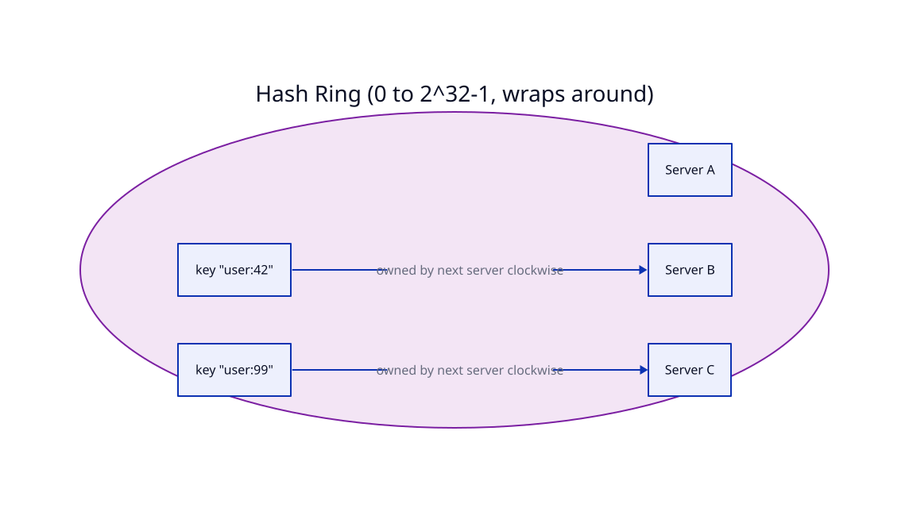
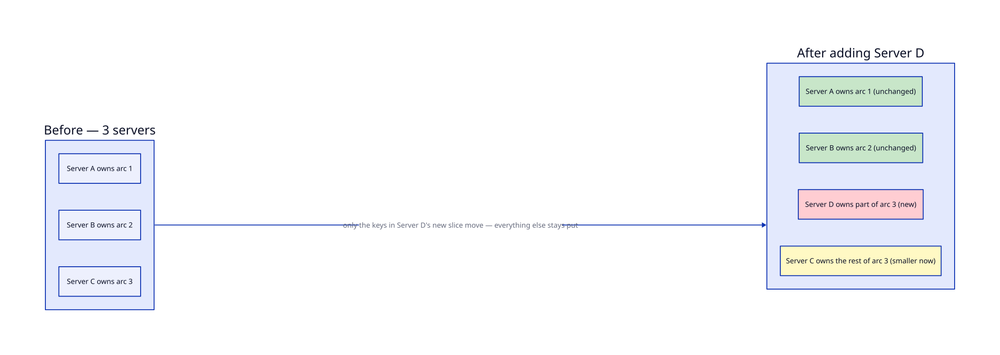

# Consistent Hashing

## Problem

You need to spread data (or requests) across multiple servers — a distributed cache, a set of DB shards, a CDN's edge servers. Whatever scheme you use, it needs to answer one question fast: *given this key, which server owns it?*

## Core idea

### The normal approach: `hash(key) % N`

The obvious answer: number your servers `0` to `N-1`. To find a key's owner, compute `hash(key)` (a large integer) and take it **modulo `N`**. Same key, same hash, same result every time — as long as `N` doesn't change. It's simple, needs no extra data structure, and the lookup is O(1) math.

A tiny concrete example with `N = 3` servers:

| key | hash(key) | `hash % 3` → server |
|---|---|---|
| "user:1" | 17 | 2 |
| "user:2" | 22 | 1 |
| "user:3" | 30 | 0 |
| "user:4" | 41 | 2 |

This works great — right up until `N` changes.

**Now add a 4th server.** Same hashes, but the modulus is now 4:

| key | hash(key) | `hash % 4` → server |
|---|---|---|
| "user:1" | 17 | 1 |
| "user:2" | 22 | 2 |
| "user:3" | 30 | 2 |
| "user:4" | 41 | 1 |

Every single key just got reassigned to a different server, even though only one new machine joined. This isn't a fluke of this tiny example — changing the modulus in `x % N` scrambles the result for the large majority of inputs, essentially every time. In a real system, that means every cache goes cold at once, or an entire DB needs reshuffling, all because you added *one* machine. This is exactly the "resharding is painful" trap flagged in the DB Scaling lesson.

### The fix: consistent hashing

Instead of hashing keys into buckets numbered `0` to `N-1`, map **both servers and keys onto the same circular hash space** — a ring, say `0` to `2^32 - 1`, wrapping back to `0`.

1. Hash each server's identifier (its name or IP) to get a position on the ring.
2. Hash each key the same way, onto the same ring.
3. A key is **owned by the first server found walking clockwise** from the key's position.
4. **Adding a server**: it lands somewhere on the ring and takes over only the keys between itself and its counter-clockwise neighbor — one arc. Every other key's owner is completely unaffected, because their clockwise-nearest server hasn't changed.
5. **Removing a server**: only its keys move to the next server clockwise. Again, nothing else shifts.

The payoff: a membership change reassigns roughly `1/N` of the keys, not nearly all of them — the opposite of what just happened with plain `% N` above.

**One practical wrinkle — virtual nodes:** with each server hashed to just one point, ring positions land wherever the hash happens to fall, so one server can end up owning a huge arc and another a tiny one, purely by chance. The fix is to hash each physical server to *many* points on the ring (100+ virtual nodes each), spreading its ownership across many small arcs instead of one big one — evening out the load statistically.

## Trade-offs

| | Gain (+) | Cost (−) |
|---|---|---|
| Ring-based ownership | Adding/removing a server reshuffles only ~1/N of keys, not nearly all of them | More complex to implement than plain `hash % N` — needs the ring structure and a "find next clockwise" lookup (typically a sorted structure + binary search) |
| Membership changes are graceful | Nodes can join or leave without a global rebalance | The `1/N` of keys that *do* move still have to be physically migrated/repopulated — this shrinks the blast radius, it doesn't eliminate movement |
| Virtual nodes | Evens out load across physical servers | Without virtual nodes, distribution can be quite uneven — an easy thing to get bitten by if you implement the "just the ring" version and skip this |
| — | — | It only solves *ownership + reshuffle-on-change* — it doesn't remove sharding's other costs (cross-node queries/transactions are just as hard as in plain sharding) |

## Worked example

Three cache servers — A, B, C — hashed onto a ring.

1. Add a fourth server, D. With plain `hash(key) % N`, this alone would have reshuffled nearly every key, as shown above. With consistent hashing, D lands at some position on the ring and takes over only the arc between itself and its counter-clockwise neighbor — roughly a quarter of the keys. The other three-quarters stay exactly where they were, because their nearest clockwise server never changed.
2. **Virtual nodes in action:** if A happened to land next to C on the ring and ended up owning a disproportionately large arc, giving each server 100 virtual positions instead of one spreads each server's ownership across many small, scattered arcs — no single server gets an unlucky oversized share just from where its one hash happened to fall.

## Where it's used

Distributed caches (Memcached, Redis Cluster), distributed hash tables (e.g. Chord), CDN request routing, and DB sharding schemes that need to add/remove nodes without a full rebalance (Cassandra and DynamoDB both use consistent hashing internally).

## Diagrams

